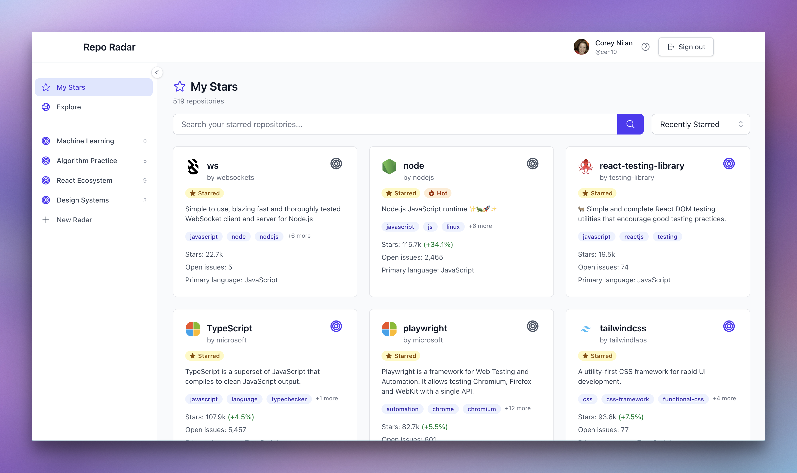
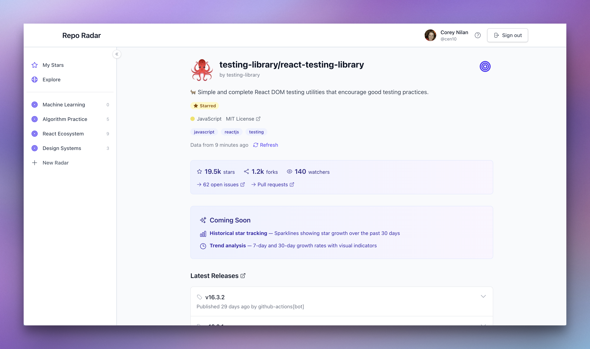
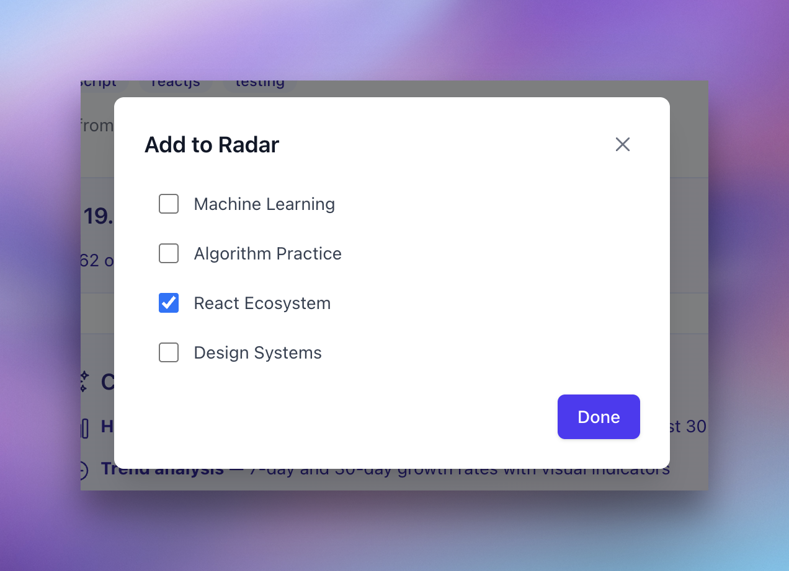
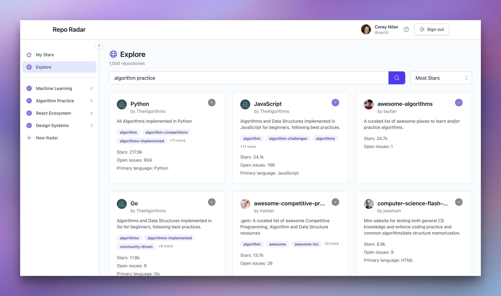

# Repo Radar

[](https://github.com/cen10/repo-radar/actions/workflows/ci.yml)
[](https://github.com/cen10/repo-radar/actions/workflows/e2e.yml)

**[Live Demo](https://the-repo-radar.vercel.app)**

Organize and track your GitHub starred repositories. Create custom collections (radars), monitor star growth trends, and discover which repos are gaining momentum. Built as a portfolio project demonstrating React 19, strict TypeScript, and full-stack testing with Vitest and Playwright.



## Features

- **Radars** - Create custom collections to organize repositories by topic, project, or interest
- **Star Tracking** - Monitor star growth across your starred repositories
- **Release Monitoring** - Track release cycles and versioning patterns
- **GitHub OAuth** - Secure authentication with your GitHub account

## Screenshots







## Tech Stack

| Category  | Technology                                |
| --------- | ----------------------------------------- |
| Framework | React 19, Vite 7                          |
| Language  | TypeScript 5 (strict mode)                |
| Styling   | TailwindCSS v4, Headless UI               |
| State     | TanStack Query                            |
| Auth & DB | Supabase (PostgreSQL + GitHub OAuth)      |
| Testing   | Vitest, React Testing Library, Playwright |
| CI/CD     | GitHub Actions                            |

## Local Development

### Prerequisites

- Node.js 20+
- Supabase account
- GitHub OAuth app

### Setup

```bash
git clone https://github.com/cen10/repo-radar.git
cd repo-radar
npm install
cp .env.local.example .env.local
# Add your Supabase credentials to .env.local
npm run dev
```

### Environment Variables

```env
VITE_SUPABASE_URL=your_supabase_project_url
VITE_SUPABASE_ANON_KEY=your_supabase_anon_key
```

### Supabase Setup

1. Create a Supabase project at [supabase.com](https://supabase.com)
2. Enable GitHub OAuth: Authentication → Providers → GitHub
3. Add redirect URLs: `http://localhost:5173/**` for local dev
4. Copy project URL and anon key to `.env.local`

## Scripts

```bash
npm run dev          # Development server
npm run build        # Production build
npm run test         # Unit & integration tests
npm run test:e2e     # Playwright E2E tests
npm run typecheck    # TypeScript checking
npm run lint         # ESLint
npm run format       # Prettier
```

## Project Structure

```
src/
├── components/     # React components (tests co-located)
├── pages/          # Route pages
├── hooks/          # Custom React hooks
├── services/       # API clients (GitHub, Supabase)
├── contexts/       # React contexts (auth)
├── types/          # TypeScript interfaces
└── utils/          # Utility functions
```

## License

MIT
