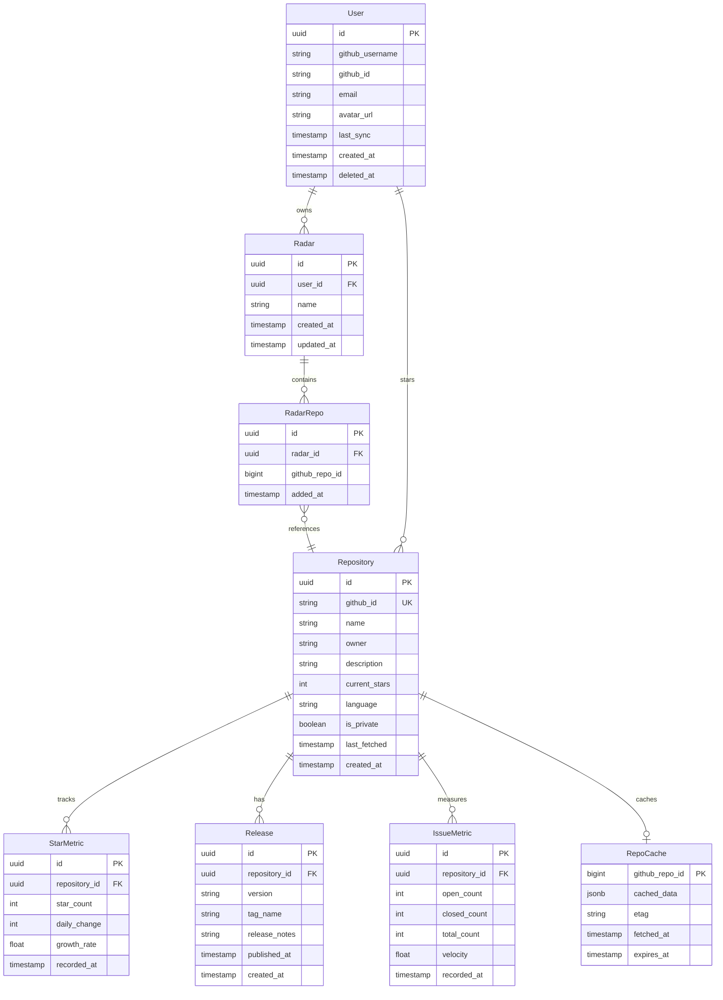

# Data Model: GitHub Repository Momentum Dashboard

**Version**: 1.0.0
**Date**: 2025-09-15

## Overview

This document defines the data entities, relationships, and validation rules for the GitHub Repository Momentum Dashboard. The model is designed for PostgreSQL (via Supabase) with TypeScript interfaces for type safety.

## Entity Relationship Diagram



## Entity Definitions

### User

Represents an authenticated GitHub user with dashboard access.

```typescript
interface User {
  id: string; // UUID
  github_username: string;
  github_id: string; // GitHub's unique ID
  email?: string;
  avatar_url?: string;
  last_sync?: Date; // Last time starred repos were synced
  created_at: Date;
  deleted_at?: Date; // Soft delete timestamp
}
```

**Validation Rules**:
- `github_username`: Required, unique, alphanumeric with hyphens
- `github_id`: Required, unique, numeric string
- `email`: Optional, valid email format if provided
- `deleted_at`: When set, user is soft-deleted

### Repository

GitHub repository with tracked metrics.

```typescript
interface Repository {
  id: string; // UUID
  github_id: string; // GitHub's unique ID
  name: string;
  owner: string;
  full_name: string; // owner/name
  description?: string;
  current_stars: number;
  language?: string;
  is_private: boolean;
  last_fetched?: Date;
  created_at: Date;
}
```

**Validation Rules**:
- `github_id`: Required, unique
- `name`: Required, valid GitHub repo name
- `owner`: Required, valid GitHub username
- `current_stars`: Non-negative integer
- `full_name`: Computed as `${owner}/${name}`

### StarMetric

Time-series data for repository star counts.

```typescript
interface StarMetric {
  id: string; // UUID
  repository_id: string; // FK to Repository
  star_count: number;
  daily_change: number; // Stars gained/lost since yesterday
  weekly_change: number; // Stars gained/lost in 7 days
  growth_rate: number; // Percentage growth (daily)
  is_spike: boolean; // Meets rapid growth criteria
  recorded_at: Date;
}
```

**Validation Rules**:
- `star_count`: Non-negative integer
- `growth_rate`: Calculated as `(current - previous) / previous * 100`
- `is_spike`: True if star_count >= 100 AND growth_rate >= 25% AND daily_change >= 50
- One record per repository per day (deduped)

### Release

Repository release information.

```typescript
interface Release {
  id: string; // UUID
  repository_id: string; // FK to Repository
  github_id: string; // GitHub's release ID
  version: string;
  tag_name: string;
  name?: string;
  body?: string; // Release notes
  is_prerelease: boolean;
  published_at: Date;
  created_at: Date;
}
```

**Validation Rules**:
- `version`: Semantic versioning format preferred
- `tag_name`: Required, matches GitHub tag
- Unique constraint on `(repository_id, github_id)`

### IssueMetric

Aggregated issue statistics for repositories.

```typescript
interface IssueMetric {
  id: string; // UUID
  repository_id: string; // FK to Repository
  open_count: number;
  closed_count: number;
  total_count: number; // open + closed
  velocity: number; // Issues closed per day (7-day average)
  avg_close_time?: number; // Hours to close (optional)
  recorded_at: Date;
}
```

**Validation Rules**:
- All counts are non-negative integers
- `total_count` = `open_count` + `closed_count`
- `velocity`: Calculated from last 7 days of closed issues
- One record per repository per day

### RepoCache

Server-side cache for GitHub API responses, shared across all users.

```typescript
interface RepoCache {
  github_repo_id: number; // GitHub's numeric repository ID (PK)
  cached_data: object; // Full GitHub API response (repo details, issues, etc.)
  etag?: string; // GitHub ETag for conditional requests
  fetched_at: Date; // When this data was fetched
  expires_at: Date; // When this cache entry should be considered stale
}
```

**Validation Rules**:
- `github_repo_id`: Required, unique (primary key)
- `cached_data`: Required, valid JSON object
- `etag`: Optional, used for conditional GitHub API requests
- `expires_at`: Typically `fetched_at + 1 hour` for detail pages, `fetched_at + 24 hours` for list data

**Design Notes**:
- This is a shared cache - all users benefit from cached data for popular repos
- The daily sync job updates cache entries for all repos on at least one radar
- Manual refresh bypasses the cache and updates it with fresh data
- ETags enable conditional requests (304 Not Modified) to minimize rate limit usage

### Radar

A user-created collection for organizing repositories to actively monitor.

```typescript
interface Radar {
  id: string; // UUID
  user_id: string; // FK to User (via Supabase auth.uid())
  name: string; // User-defined name for the radar
  created_at: Date;
  updated_at: Date;
}
```

**Validation Rules**:
- `name`: Required, 1-50 characters
- Maximum 5 radars per user (enforced at application level)
- `user_id`: Maps to Supabase auth.uid()

### RadarRepo

The association between a radar and a repository.

```typescript
interface RadarRepo {
  id: string; // UUID
  radar_id: string; // FK to Radar
  github_repo_id: number; // GitHub's numeric repository ID (stable across renames)
  added_at: Date;
}
```

**Validation Rules**:
- Unique constraint on `(radar_id, github_repo_id)`
- Maximum 25 repos per radar (enforced at application level)
- Maximum 50 total repos across all user's radars (enforced at application level)
- A repository can belong to multiple radars (same user or different users)

**Design Notes**:
- Uses GitHub's numeric `id` rather than a local Repository UUID to avoid needing to sync all repos to our database
- Repository metadata is fetched from GitHub API on-demand, not stored locally (except for repos on radars where we track metrics)

## State Transitions

### Repository Sync States

```
PENDING → SYNCING → SYNCED
           ↓
         FAILED → RETRY → SYNCING
```

### User Account States

```
ACTIVE → SOFT_DELETED → HARD_DELETED (after 30 days)
   ↑          ↓
   └─ RECOVERED (within 30 days)
```

## Indexes

Optimized for common query patterns:

```sql
-- User queries
CREATE INDEX idx_users_github_id ON users(github_id);
CREATE INDEX idx_users_deleted_at ON users(deleted_at) WHERE deleted_at IS NULL;

-- Repository queries
CREATE INDEX idx_repos_github_id ON repositories(github_id);
CREATE INDEX idx_repos_full_name ON repositories(owner, name);

-- Metrics queries (time-series)
CREATE INDEX idx_star_metrics_repo_time ON star_metrics(repository_id, recorded_at DESC);
CREATE INDEX idx_star_metrics_spike ON star_metrics(is_spike) WHERE is_spike = true;
CREATE INDEX idx_issue_metrics_repo_time ON issue_metrics(repository_id, recorded_at DESC);

-- Radars
CREATE INDEX idx_radars_user ON radars(user_id);
CREATE UNIQUE INDEX idx_radar_repos_unique ON radar_repos(radar_id, github_repo_id);
CREATE INDEX idx_radar_repos_github_id ON radar_repos(github_repo_id);

-- Releases
CREATE INDEX idx_releases_repo_published ON releases(repository_id, published_at DESC);

-- Cache
CREATE INDEX idx_repo_cache_expires ON repo_cache(expires_at);
```

## Row Level Security Policies

```sql
-- Users can only manage their own radars
ALTER TABLE radars ENABLE ROW LEVEL SECURITY;
CREATE POLICY "Users manage own radars" ON radars
  FOR ALL USING (auth.uid() = user_id);

-- Users can only manage repos in their own radars
ALTER TABLE radar_repos ENABLE ROW LEVEL SECURITY;
CREATE POLICY "Users manage own radar repos" ON radar_repos
  FOR ALL USING (
    EXISTS (
      SELECT 1 FROM radars
      WHERE radars.id = radar_repos.radar_id
      AND radars.user_id = auth.uid()
    )
  );

-- Public repository data is visible to all authenticated users
ALTER TABLE repositories ENABLE ROW LEVEL SECURITY;
CREATE POLICY "Authenticated users see repos" ON repositories
  FOR SELECT USING (auth.role() = 'authenticated');

-- Metrics are public for public repos
ALTER TABLE star_metrics ENABLE ROW LEVEL SECURITY;
CREATE POLICY "Authenticated users see metrics" ON star_metrics
  FOR SELECT USING (
    EXISTS (
      SELECT 1 FROM repositories
      WHERE repositories.id = star_metrics.repository_id
      AND auth.role() = 'authenticated'
    )
  );

-- Cache is readable by all authenticated users, writable by service role only
ALTER TABLE repo_cache ENABLE ROW LEVEL SECURITY;
CREATE POLICY "Authenticated users read cache" ON repo_cache
  FOR SELECT USING (auth.role() = 'authenticated');
-- Note: INSERT/UPDATE/DELETE handled by service role (bypasses RLS)
```

## Data Retention

- **StarMetric**: Daily snapshots, keep for 90 days
- **IssueMetric**: Daily snapshots, keep for 90 days
- **Release**: Keep indefinitely (low volume)
- **User**: Soft delete immediately, hard delete after 30 days
- **Radar**: Delete with user account (cascade to RadarRepo)
- **RadarRepo**: Delete when radar is deleted or when explicitly removed
- **Repository**: Keep for 90-day grace period after last radar reference is removed, then delete with associated metrics
- **RepoCache**: Entries expire based on `expires_at`; stale entries cleaned up by scheduled job (keep expired entries for 7 days as fallback for rate-limited scenarios)

**Rationale for daily snapshots**: Hourly collection doesn't scale well with GitHub API rate limits (5,000 req/hour authenticated). Daily snapshots allow tracking tens of thousands of repos within limits, while still providing meaningful day-over-day and weekly trend data. Can add tiered hourly collection for "hot" repos in the future if needed.

## Migration Strategy

Initial schema creation with versioned migrations:

```sql
-- 001_create_radars.sql (includes radars and radar_repos tables)
-- 002_create_repositories.sql
-- 003_create_metrics.sql
-- 004_create_repo_cache.sql
-- 005_create_indexes.sql
-- 006_enable_rls.sql
```

Each migration is idempotent and includes rollback procedures.

## Related Documents

- **[ux-spec.md](./ux-spec.md)**: UX design specification detailing how radars are presented and managed in the UI