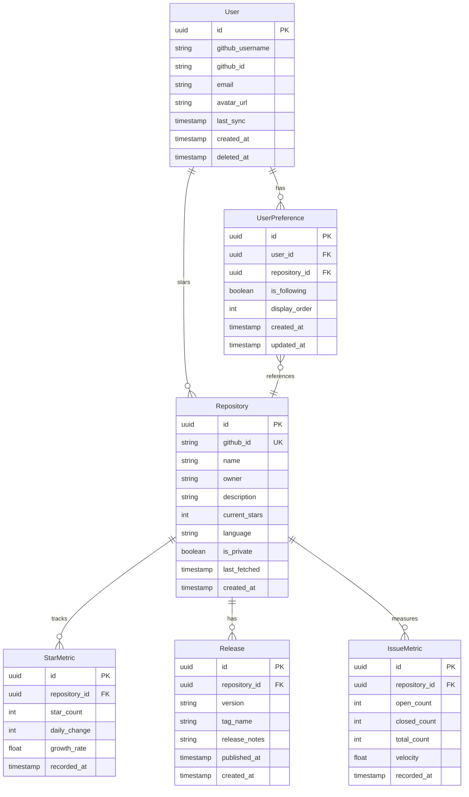

# Data Model: GitHub Repository Momentum Dashboard

**Version**: 1.0.0
**Date**: 2025-09-15

## Overview

This document defines the data entities, relationships, and validation rules for the GitHub Repository Momentum Dashboard. The model is designed for PostgreSQL (via Supabase) with TypeScript interfaces for type safety.

## Entity Relationship Diagram



## Entity Definitions

### User

Represents an authenticated GitHub user with dashboard access.

```typescript
interface User {
  id: string; // UUID
  github_username: string;
  github_id: string; // GitHub's unique ID
  email?: string;
  avatar_url?: string;
  last_sync?: Date; // Last time starred repos were synced
  created_at: Date;
  deleted_at?: Date; // Soft delete timestamp
}
```

**Validation Rules**:
- `github_username`: Required, unique, alphanumeric with hyphens
- `github_id`: Required, unique, numeric string
- `email`: Optional, valid email format if provided
- `deleted_at`: When set, user is soft-deleted

### Repository

GitHub repository with tracked metrics.

```typescript
interface Repository {
  id: string; // UUID
  github_id: string; // GitHub's unique ID
  name: string;
  owner: string;
  full_name: string; // owner/name
  description?: string;
  current_stars: number;
  language?: string;
  is_private: boolean;
  last_fetched?: Date;
  created_at: Date;
}
```

**Validation Rules**:
- `github_id`: Required, unique
- `name`: Required, valid GitHub repo name
- `owner`: Required, valid GitHub username
- `current_stars`: Non-negative integer
- `full_name`: Computed as `${owner}/${name}`

### StarMetric

Time-series data for repository star counts.

```typescript
interface StarMetric {
  id: string; // UUID
  repository_id: string; // FK to Repository
  star_count: number;
  daily_change: number; // Stars gained/lost since yesterday
  weekly_change: number; // Stars gained/lost in 7 days
  growth_rate: number; // Percentage growth (daily)
  is_spike: boolean; // Meets rapid growth criteria
  recorded_at: Date;
}
```

**Validation Rules**:
- `star_count`: Non-negative integer
- `growth_rate`: Calculated as `(current - previous) / previous * 100`
- `is_spike`: True if star_count >= 100 AND growth_rate >= 25% AND daily_change >= 50
- One record per repository per hour (deduped)

### Release

Repository release information.

```typescript
interface Release {
  id: string; // UUID
  repository_id: string; // FK to Repository
  github_id: string; // GitHub's release ID
  version: string;
  tag_name: string;
  name?: string;
  body?: string; // Release notes
  is_prerelease: boolean;
  published_at: Date;
  created_at: Date;
}
```

**Validation Rules**:
- `version`: Semantic versioning format preferred
- `tag_name`: Required, matches GitHub tag
- Unique constraint on `(repository_id, github_id)`

### IssueMetric

Aggregated issue statistics for repositories.

```typescript
interface IssueMetric {
  id: string; // UUID
  repository_id: string; // FK to Repository
  open_count: number;
  closed_count: number;
  total_count: number; // open + closed
  velocity: number; // Issues closed per day (7-day average)
  avg_close_time?: number; // Hours to close (optional)
  recorded_at: Date;
}
```

**Validation Rules**:
- All counts are non-negative integers
- `total_count` = `open_count` + `closed_count`
- `velocity`: Calculated from last 7 days of closed issues
- One record per repository per hour

### UserPreference

User-specific repository preferences (follow/unfollow).

```typescript
interface UserPreference {
  id: string; // UUID
  user_id: string; // FK to User
  repository_id: string; // FK to Repository
  is_following: boolean;
  display_order?: number; // Custom sort order
  notification_enabled: boolean;
  created_at: Date;
  updated_at: Date;
}
```

**Validation Rules**:
- Unique constraint on `(user_id, repository_id)`
- `is_following`: Default true for newly starred repos
- `display_order`: Optional, for custom sorting

## State Transitions

### Repository Sync States

```
PENDING → SYNCING → SYNCED
           ↓
         FAILED → RETRY → SYNCING
```

### User Account States

```
ACTIVE → SOFT_DELETED → HARD_DELETED (after 30 days)
   ↑          ↓
   └─ RECOVERED (within 30 days)
```

## Indexes

Optimized for common query patterns:

```sql
-- User queries
CREATE INDEX idx_users_github_id ON users(github_id);
CREATE INDEX idx_users_deleted_at ON users(deleted_at) WHERE deleted_at IS NULL;

-- Repository queries
CREATE INDEX idx_repos_github_id ON repositories(github_id);
CREATE INDEX idx_repos_full_name ON repositories(owner, name);

-- Metrics queries (time-series)
CREATE INDEX idx_star_metrics_repo_time ON star_metrics(repository_id, recorded_at DESC);
CREATE INDEX idx_star_metrics_spike ON star_metrics(is_spike) WHERE is_spike = true;
CREATE INDEX idx_issue_metrics_repo_time ON issue_metrics(repository_id, recorded_at DESC);

-- User preferences
CREATE UNIQUE INDEX idx_user_prefs_unique ON user_preferences(user_id, repository_id);
CREATE INDEX idx_user_prefs_following ON user_preferences(user_id, is_following);

-- Releases
CREATE INDEX idx_releases_repo_published ON releases(repository_id, published_at DESC);
```

## Row Level Security Policies

```sql
-- Users can only see their own data
ALTER TABLE user_preferences ENABLE ROW LEVEL SECURITY;
CREATE POLICY "Users manage own preferences" ON user_preferences
  FOR ALL USING (auth.uid() = user_id);

-- Public repository data is visible to all authenticated users
ALTER TABLE repositories ENABLE ROW LEVEL SECURITY;
CREATE POLICY "Authenticated users see repos" ON repositories
  FOR SELECT USING (auth.role() = 'authenticated');

-- Metrics are public for public repos
ALTER TABLE star_metrics ENABLE ROW LEVEL SECURITY;
CREATE POLICY "Authenticated users see metrics" ON star_metrics
  FOR SELECT USING (
    EXISTS (
      SELECT 1 FROM repositories
      WHERE repositories.id = star_metrics.repository_id
      AND auth.role() = 'authenticated'
    )
  );
```

## Data Retention

- **StarMetric**: Keep hourly for 7 days, daily for 90 days
- **IssueMetric**: Keep hourly for 7 days, daily for 90 days
- **Release**: Keep indefinitely (low volume)
- **User**: Soft delete immediately, hard delete after 30 days
- **UserPreference**: Delete with user account

## Migration Strategy

Initial schema creation with versioned migrations:

```sql
-- 001_create_users.sql
-- 002_create_repositories.sql
-- 003_create_metrics.sql
-- 004_create_preferences.sql
-- 005_create_indexes.sql
-- 006_enable_rls.sql
```

Each migration is idempotent and includes rollback procedures.