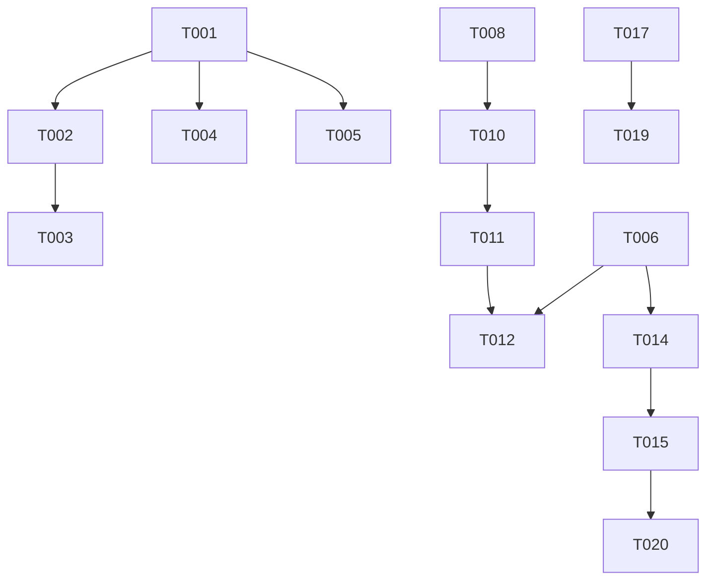

# Tasks: GitHub Repository Momentum Dashboard

**Input**: Design documents from `/specs/001-develop-a-personalized/`
**Prerequisites**: plan.md (required), research.md, data-model.md, contracts/api-spec.yaml

## Execution Flow (main)

```
1. Load plan.md from feature directory
   → If not found: ERROR "No implementation plan found"
   → Extract: tech stack, libraries, structure
2. Load optional design documents:
   → data-model.md: Extract entities → model tasks
   → contracts/: Each file → contract test task
   → research.md: Extract decisions → setup tasks
3. Generate tasks by category:
   → Setup: project init, dependencies, linting
   → Tests: contract tests, integration tests
   → Core: models, services, CLI commands
   → Integration: DB, middleware, logging
   → Polish: unit tests, performance, docs
4. Apply task rules:
   → Different files = mark [P] for parallel
   → Same file = sequential (no [P])
   → Tests before implementation (TDD)
5. Number tasks sequentially (T001, T002...)
6. Generate dependency graph
7. Create parallel execution examples
8. Validate task completeness:
   → All contracts have tests?
   → All entities have models?
   → All endpoints implemented?
9. Return: SUCCESS (tasks ready for execution)
```

## Format: `[ID] [P?] Description`

- **[P]**: Can run in parallel (different files, no dependencies)
- Include exact file paths in descriptions

## Path Conventions

- Frontend: `src/` for React components and services
- Backend: `api/` for serverless functions
- Tests: `tests/` for all test files
- Types: `src/types/` for shared TypeScript interfaces

---

# MVP SLICE 1: Static Dashboard (T001-T020)

_Goal: Basic dashboard showing starred repositories_

## Phase 3.1: Setup (T001-T005)

- [x] T001 Initialize React project with Vite: `npm create vite@latest . -- --template react-ts`
- [x] T002 Install core dependencies: `npm install @tanstack/react-query tailwindcss @headlessui/react`
- [x] T003 [P] Configure TailwindCSS in `tailwind.config.js` and `src/index.css`
- [x] T004 [P] Set up ESLint and Prettier with configs in `.eslintrc.json` and `.prettierrc`
- [x] T005 [P] Create environment variables file `.env.local` with VITE_GITHUB_CLIENT_ID placeholder

## Phase 3.2: Type Definitions (T006-T007)

- [x] T006 [P] Create TypeScript interfaces in `src/types/index.ts` for User and Repository
- [x] T007 [P] Create API response types in `src/types/api.ts` for GitHub API responses

## Phase 3.3: Authentication Setup (T008-T011)

- [x] T008 Create Supabase project and configure GitHub OAuth provider in dashboard
- [x] T009 Install Supabase client: `npm install @supabase/supabase-js`
- [x] T010 Create Supabase client configuration in `src/services/supabase.ts`
- [x] T011 Create auth context provider in `src/contexts/AuthContext.tsx`

## Phase 3.4: Core Components (T012-T016)

- [x] T012 Create Login page component in `src/pages/Login.tsx` with GitHub OAuth button
- [x] T013 Create Header component in `src/components/Header.tsx` with user info and logout
- [ ] T014 Create RepoCard component in `src/components/RepoCard.tsx` to display repository info
- [ ] T015 Create Dashboard page in `src/pages/Dashboard.tsx` with repository list
- [ ] T016 [P] Create Loading component in `src/components/Loading.tsx` for loading states

## Phase 3.5: API Integration (T017-T019)

- [ ] T017 Create GitHub service in `src/services/github.ts` to fetch starred repositories
- [ ] T018 Create serverless function in `api/starred.ts` to proxy GitHub API calls
- [ ] T019 Set up React Query hooks in `src/hooks/useRepositories.ts` for data fetching

## Phase 3.6: Routing & Polish (T020)

- [ ] T020 Configure React Router in `src/App.tsx` with Login and Dashboard routes

---

# MVP SLICE 2: Live Metrics (T021-T032)

_Goal: Add current metrics and growth indicators_

## Phase 3.7: Enhanced Types (T021-T022)

- [ ] T021 [P] Extend Repository type in `src/types/index.ts` with metrics fields
- [ ] T022 [P] Create MetricsData type for growth calculations

## Phase 3.8: Metrics Utilities (T023-T025)

- [ ] T023 [P] Create metrics calculation utilities in `src/utils/metrics.ts`
- [ ] T024 [P] Create date formatting utilities in `src/utils/formatters.ts`
- [ ] T025 [P] Create sorting utilities in `src/utils/sort.ts`

## Phase 3.9: Enhanced API (T026-T028)

- [ ] T026 Update `api/starred.ts` to fetch repository issues and releases
- [ ] T027 Create `api/metrics.ts` endpoint to calculate growth rates
- [ ] T028 Update `src/services/github.ts` to use enhanced endpoints

## Phase 3.10: UI Updates (T029-T032)

- [ ] T029 Update RepoCard to display metrics with growth indicators
- [ ] T030 Add refresh button to Header component
- [ ] T031 Add last updated timestamp to Dashboard
- [ ] T032 [P] Create HotBadge component in `src/components/HotBadge.tsx` for trending repos

---

# MVP SLICE 3: Personal Tracking (T033-T046)

_Goal: Follow/unfollow with persistence_

## Phase 3.11: Database Setup (T033-T036)

- [ ] T033 Create Supabase migrations in `supabase/migrations/001_initial_schema.sql`
- [ ] T034 Set up Row Level Security policies for user_preferences table
- [ ] T035 [P] Create database types in `src/types/database.ts`
- [ ] T036 Create Supabase service functions in `src/services/database.ts`

## Phase 3.12: Preference Management (T037-T040)

- [ ] T037 Create `api/preferences.ts` endpoint for managing follow/unfollow
- [ ] T038 Create usePreferences hook in `src/hooks/usePreferences.ts`
- [ ] T039 Add follow/unfollow toggle to RepoCard component
- [ ] T040 Create preference state management in Dashboard

## Phase 3.13: Filtering & Views (T041-T044)

- [ ] T041 Create FilterBar component in `src/components/FilterBar.tsx`
- [ ] T042 Add "All" vs "Following" filter logic to Dashboard
- [ ] T043 [P] Create EmptyState component in `src/components/EmptyState.tsx`
- [ ] T044 Implement pagination logic in useRepositories hook

## Phase 3.14: Testing Slice 3 (T045-T046)

- [ ] T045 [P] Write integration tests for preference persistence in `tests/integration/preferences.test.ts`
- [ ] T046 [P] Write E2E test for follow/unfollow flow in `tests/e2e/tracking.spec.ts`

---

# MVP SLICE 4: Trend Detection (T047-T062)

_Goal: Historical tracking and trend visualization_

## Phase 3.15: Historical Data Schema (T047-T050)

- [ ] T047 Create migration for star_metrics table in `supabase/migrations/002_metrics.sql`
- [ ] T048 Create migration for issue_metrics table
- [ ] T049 [P] Update database types for metrics entities
- [ ] T050 Create metrics service in `src/services/metrics.ts`

## Phase 3.16: Data Collection (T051-T054)

- [ ] T051 Create `api/sync.ts` serverless function for data collection
- [ ] T052 Configure Vercel cron job in `vercel.json` for hourly sync
- [ ] T053 Create sync status endpoint in `api/sync-status.ts`
- [ ] T054 Add sync status indicator to Dashboard

## Phase 3.17: Trend Calculations (T055-T057)

- [ ] T055 [P] Create trend calculation utilities in `src/utils/trends.ts`
- [ ] T056 Update metrics service to fetch historical data
- [ ] T057 Create useTrends hook in `src/hooks/useTrends.ts`

## Phase 3.18: Sparkline Charts (T058-T062)

- [ ] T058 Install chart library: `npm install react-sparklines`
- [ ] T059 [P] Create SparklineChart component in `src/components/charts/SparklineChart.tsx`
- [ ] T060 Add sparklines to RepoCard component
- [ ] T061 Create TrendingSection component in `src/components/TrendingSection.tsx`
- [ ] T062 Add sort by growth rate option to Dashboard

---

# MVP SLICE 5: Full Analytics (T063-T080)

_Goal: Detailed analytics and complete features_

## Phase 3.19: Full Charts (T063-T067)

- [ ] T063 Install Chart.js: `npm install chart.js react-chartjs-2`
- [ ] T064 [P] Create LineChart component in `src/components/charts/LineChart.tsx`
- [ ] T065 [P] Create BarChart component in `src/components/charts/BarChart.tsx`
- [ ] T066 Create MetricsModal component in `src/components/MetricsModal.tsx`
- [ ] T067 Add "View Details" action to RepoCard

## Phase 3.20: Advanced Metrics (T068-T071)

- [ ] T068 Create `api/repos/[id]/metrics.ts` for detailed metrics
- [ ] T069 Add release timeline to MetricsModal
- [ ] T070 Calculate and display issue velocity
- [ ] T071 Create useDetailedMetrics hook

## Phase 3.21: Data Export (T072-T074)

- [ ] T072 [P] Create CSV export utility in `src/utils/export.ts`
- [ ] T073 Add export button to Dashboard
- [ ] T074 Create `api/export.ts` endpoint for data export

## Phase 3.22: Account Management (T075-T077)

- [ ] T075 Create AccountSettings page in `src/pages/AccountSettings.tsx`
- [ ] T076 Create `api/user/delete.ts` endpoint for account deletion
- [ ] T077 Implement soft delete with 30-day recovery window

## Phase 3.23: PWA & Polish (T078-T080)

- [ ] T078 [P] Create PWA manifest in `public/manifest.json`
- [ ] T079 [P] Add service worker for offline support
- [ ] T080 Performance optimization: implement virtual scrolling for large lists

## Phase 3.24 Test Architecture Restructuring (T081-T084)

_Goal: Separate unit, integration, and E2E tests for clearer responsibilities_

**Problem**: Current component tests mock child components (e.g., Dashboard.test.tsx mocks RepositoryList), creating mock maintenance burden without integration confidence. Mocks can drift from real implementations.

**Solution**: Three-tier test structure:

- [ ] T081 Create integration test directory structure in `src/__integration__/` or `tests/integration/`
- [ ] T082 Refactor `Dashboard.test.tsx`: Extract interaction tests (search, filter, star/unstar) to integration tests, keep only Dashboard-specific unit logic
- [ ] T083 Refactor `RepositoryList.test.tsx`: Extract interaction tests to integration tests
- [ ] T084 Update test documentation in CLAUDE.md with new test tier guidelines

**Test tiers after refactor**:

1. **Unit tests** - Isolated logic: utilities, API services, hooks, pure functions
2. **Integration tests** - Real component trees with mocked external boundaries (API, auth)
3. **E2E tests (Playwright)** - Full browser flows

---

## Parallel Execution Examples

### Batch 1: Initial Setup (can run together)

```bash
# Terminal 1
Task T003: Configure TailwindCSS

# Terminal 2
Task T004: Set up ESLint and Prettier

# Terminal 3
Task T005: Create environment variables
```

### Batch 2: Type Definitions (can run together)

```bash
# Terminal 1
Task T006: Create core TypeScript interfaces

# Terminal 2
Task T007: Create API response types
```

### Batch 3: Component Creation (can run together after auth setup)

```bash
# Terminal 1
Task T016: Create Loading component

# Terminal 2
Task T043: Create EmptyState component
```

## Task Dependencies



## Validation Checklist

- ✅ All API endpoints from contracts have implementation tasks
- ✅ All entities from data-model have type definitions
- ✅ Authentication flow is complete (T008-T011)
- ✅ Each slice builds on the previous one
- ✅ Parallel tasks marked with [P] don't share files
- ✅ Testing tasks included for critical paths
- ✅ Performance optimizations in final slice

## Notes

1. **Slice 1 Priority**: Complete T001-T020 first for a deployable MVP
2. **Testing Strategy**: Integration tests focus on critical paths (auth, preferences, sync)
3. **Parallel Execution**: Tasks marked [P] can run simultaneously if they modify different files
4. **Environment Setup**: Requires Supabase account and GitHub OAuth app configuration
5. **Deployment**: Each slice is independently deployable to Vercel/Netlify

---

**Total Tasks**: 80
**Slice 1 (MVP)**: 20 tasks (~3-4 days)
**Full Implementation**: 80 tasks (~18-20 days)
