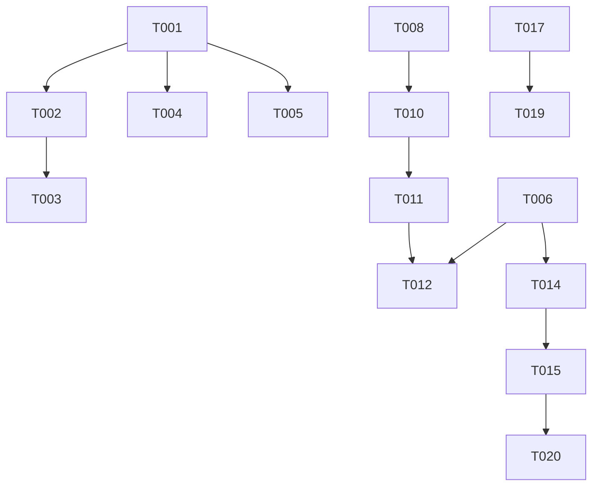

# Tasks: GitHub Repository Momentum Dashboard

**Input**: Design documents from `/specs/001-develop-a-personalized/`
**Prerequisites**: plan.md (required), research.md, data-model.md, contracts/api-spec.yaml

## Execution Flow (main)

```
1. Load plan.md from feature directory
   → If not found: ERROR "No implementation plan found"
   → Extract: tech stack, libraries, structure
2. Load optional design documents:
   → data-model.md: Extract entities → model tasks
   → contracts/: Each file → contract test task
   → research.md: Extract decisions → setup tasks
3. Generate tasks by category:
   → Setup: project init, dependencies, linting
   → Tests: contract tests, integration tests
   → Core: models, services, CLI commands
   → Integration: DB, middleware, logging
   → Polish: unit tests, performance, docs
4. Apply task rules:
   → Different files = mark [P] for parallel
   → Same file = sequential (no [P])
   → Tests before implementation (TDD)
5. Number tasks sequentially (T001, T002...)
6. Generate dependency graph
7. Create parallel execution examples
8. Validate task completeness:
   → All contracts have tests?
   → All entities have models?
   → All endpoints implemented?
9. Return: SUCCESS (tasks ready for execution)
```

## Format: `[ID] [P?] Description`

- **[P]**: Can run in parallel (different files, no dependencies)
- Include exact file paths in descriptions

## Path Conventions

- Frontend: `src/` for React components and services
- Backend: `api/` for serverless functions
- Tests: `tests/` for all test files
- Types: `src/types/` for shared TypeScript interfaces

---

# MVP SLICE 1: Static Dashboard (T001-T020)

_Goal: Basic dashboard showing starred repositories_

## Phase 3.1: Setup (T001-T005)

- [x] T001 Initialize React project with Vite: `npm create vite@latest . -- --template react-ts`
- [x] T002 Install core dependencies: `npm install @tanstack/react-query tailwindcss @headlessui/react`
- [x] T003 [P] Configure TailwindCSS in `tailwind.config.js` and `src/index.css`
- [x] T004 [P] Set up ESLint and Prettier with configs in `.eslintrc.json` and `.prettierrc`
- [x] T005 [P] Create environment variables file `.env.local` with VITE_GITHUB_CLIENT_ID placeholder

## Phase 3.2: Type Definitions (T006-T007)

- [x] T006 [P] Create TypeScript interfaces in `src/types/index.ts` for User and Repository
- [x] T007 [P] Create API response types in `src/types/api.ts` for GitHub API responses

## Phase 3.3: Authentication Setup (T008-T011)

- [x] T008 Create Supabase project and configure GitHub OAuth provider in dashboard
- [x] T009 Install Supabase client: `npm install @supabase/supabase-js`
- [x] T010 Create Supabase client configuration in `src/services/supabase.ts`
- [x] T011 Create auth context provider in `src/contexts/AuthContext.tsx`

## Phase 3.4: Core Components (T012-T016)

- [x] T012 Create Login page component in `src/pages/Login.tsx` with GitHub OAuth button
- [x] T013 Create Header component in `src/components/Header.tsx` with user info and logout
- [x] T014 Create RepoCard component in `src/components/RepoCard.tsx` to display repository info
- [x] T015 Create Dashboard page in `src/pages/Dashboard.tsx` with repository list
- [x] T016 [P] ~~Create Loading component~~ _Skipped: existing approach with inline loading states works fine_

## Phase 3.5: API Integration (T017-T019)

- [x] T017 Create GitHub service in `src/services/github.ts` to fetch starred repositories
- [x] T018 ~~Create serverless function in `api/starred.ts`~~ _Skipped: client-side GitHub API calls work well, serverless proxy adds unnecessary complexity_
- [x] T019 Set up React Query hooks in `src/hooks/useRepositories.ts` for data fetching

## Phase 3.6: Routing & Polish (T020)

- [x] T020 Configure React Router in `src/App.tsx` with Login and Dashboard routes

---

# MVP SLICE 2: Live Metrics (T021-T032)

_Goal: Add current metrics and growth indicators_

## Phase 3.7: Enhanced Types (T021-T022)

- [x] T021 [P] Extend Repository type in `src/types/index.ts` with metrics fields
- [x] T022 [P] Create MetricsData type for growth calculations _(implemented as `RepositoryMetrics` interface)_

## Phase 3.8: Metrics Utilities (T023-T025)

- [x] T023 [P] Create metrics calculation utilities in `src/utils/metrics.ts` _(implemented: calculateGrowthRate, calculateStarsGained, isHotRepo)_
- [x] T024 [P] Create date formatting utilities in `src/utils/formatters.ts` _(implemented in `src/utils/relativeTime.ts`)_
- [x] T025 [P] Create sorting utilities in `src/utils/sort.ts` _(implemented: sortByStars, sortByName, sortByGrowthRate, sortByUpdated)_

## Phase 3.9: Enhanced API & Caching (T026-T028b)

_Note: Serverless deferred to Slice 4. See [docs/serverless-decision.md](/docs/serverless-decision.md) for rationale._

- [x] T026 Add `fetchRepositoryReleases()` to `src/services/github.ts` for lazy-loading releases on detail page _(implemented with `useReleases` hook; TanStack Query handles caching)_
- [x] T027 ~~Create `api/metrics.ts` endpoint~~ _Deferred to Slice 4: Real growth rates require historical data from background sync. Using mock growth rates for now._
- [x] T028 ~~Update `src/services/github.ts` to use enhanced endpoints~~ _Skipped: No serverless endpoints; client-side GitHub calls continue as-is_
- [x] T028a Configure TanStack Query with caching settings in `src/services/queryClient.ts` (1hr staleTime, 24hr gcTime) _(configured in `src/App.tsx` with 5min staleTime, 30min gcTime)_
- [x] T028b Create `src/utils/formatters.ts` with relative time formatting for "Last updated" display _(implemented in `src/utils/relativeTime.ts`)_

## Phase 3.10: UI Updates (T029-T032)

- [x] T029 Update RepoCard to display metrics with growth indicators
- [x] T032 [P] Create HotBadge component in `src/components/HotBadge.tsx` for trending repos

---

# MVP SLICE 3: Navigation & Radar Feature (T033-T055)

_Goal: Sidebar navigation, radar collections, and repository detail pages_
_See [ux-spec.md](./ux-spec.md) for detailed UX requirements_

## Phase 3.11: Layout & Navigation (T033-T038)

- [x] T033 Create Sidebar component in `src/components/Sidebar.tsx` with My Stars, Explore nav items
- [x] T034 Create SidebarRadarList component for displaying user's radars with counts
- [x] T035 Create MobileDrawer component with hamburger menu trigger _(MobileDrawer in Sidebar.tsx, hamburger trigger in Header.tsx)_
- [x] T036 Create AppLayout wrapper component that combines Header, Sidebar, and main content _(AppLayout function in App.tsx)_
- [x] T037 Update routing in `src/App.tsx`: add /stars, /explore, /radar/:id, /repo/:id routes
- [x] T037a Wire up StarsPage and ExplorePage to use RepositoryList component with data hooks (remove tab UI, each page is standalone)
- [x] T038 Redirect /dashboard to /stars, update post-login redirect to /stars

## Phase 3.12: Supabase Schema (T039-T042a)

- [x] T039 Create Supabase migration `supabase/migrations/001_create_radars.sql` with both `radars` and `radar_repos` tables, indexes, and RLS policies (see data-model.md for schemas)
- [x] T039a Apply migrations to Supabase instance via CLI (`supabase db push`) or dashboard
- [x] T040 Update database types in `src/types/database.ts` with Radar and RadarRepo interfaces
- [x] T041 Create radar service functions in `src/services/radar.ts` (CRUD operations, enforce limits: 5 radars, 25 repos/radar, 50 total)
- [x] T042 Create Supabase migration for repo_cache table in `supabase/migrations/004_create_repo_cache.sql`
- [x] T042a Create cache service in `src/services/cache.ts` for persistent Supabase caching with ETags

## Phase 3.13: Radar UI Components (T043-T049)

- [x] T043 Create useRadars hook in `src/hooks/useRadars.ts` for fetching user's radars
- [x] T044 Create ManageRadarsModal component for "Add to Radar" interaction
- [ ] T045 Create BottomSheet component for mobile "Add to Radar" interaction
- [x] T046 Add radar icon to RepoCard with filled/outline states
- [x] T047 Create radar sweep animation CSS/component for add-to-radar feedback _(implemented in `src/index.css` and `DynamicRadarIcon.tsx`)_
- [x] T048 Create CreateRadarModal component for creating new radars from sidebar
- [x] T049 Create RadarContextMenu component with Rename/Delete actions _(implemented as kebab menu in RadarPage)_

## Phase 3.14: Radar Page & Detail Page (T050-T053, T030-T031)

- [x] T050 Create RadarPage component in `src/pages/RadarPage.tsx` with header and repo list
- [x] T051 Create RepoDetailPage component in `src/pages/RepoDetailPage.tsx`
- [x] T052 Update RepoCard click behavior to navigate to internal detail page
- [x] T030 Add refresh button to detail page
- [x] T031 Add last updated timestamp to detail page
- [x] T053 Create EmptyState components for empty radar, no stars, no search results

## Phase 3.15: Search & Polish (T054-T055)

- [ ] T054 Create CollapsibleSearch component with ⌘K shortcut support
- [ ] T055 Add limit handling UI (disabled states, tooltips for 5 radars/25 repos/50 total limits)

---

# MVP SLICE 4: Trend Detection (T056-T071)

_Goal: Historical tracking and trend visualization_

## Phase 3.16: Historical Data Schema (T056-T059)

- [ ] T056 Create migration for star_metrics table in `supabase/migrations/002_metrics.sql`
- [ ] T057 Create migration for issue_metrics table
- [ ] T058 [P] Update database types for metrics entities
- [ ] T059 Create metrics service in `src/services/metrics.ts`

## Phase 3.17: Data Collection (T060-T065)

- [ ] T060 Create `api/sync.ts` serverless function for data collection
- [ ] T061 Configure Vercel cron job in `vercel.json` for daily sync
- [ ] T062 Create sync status endpoint in `api/sync-status.ts`
- [ ] T063 Add sync status indicator to Dashboard
- [ ] T064 Add GitHub API rate limit tracking to API calls (log X-RateLimit headers)
- [ ] T065 Create rate limit alert system using Resend Free Tier (email at 75% and 90% thresholds)

_Note: Resend Free Tier provides 100 emails/day. Can migrate to Supabase Edge Functions + email provider later if needed._

## Phase 3.18: Trend Calculations (T066-T068)

- [ ] T066 [P] Create trend calculation utilities in `src/utils/trends.ts`
- [ ] T067 Update metrics service to fetch historical data
- [ ] T068 Create useTrends hook in `src/hooks/useTrends.ts`

## Phase 3.19: Sparkline Charts (T069-T073)

- [ ] T069 Install chart library: `npm install react-sparklines`
- [ ] T070 [P] Create SparklineChart component in `src/components/charts/SparklineChart.tsx`
- [ ] T071 Add sparklines to RepoCard component
- [ ] T072 Create TrendingSection component in `src/components/TrendingSection.tsx`
- [ ] T073 Add sort by growth rate option to RepositoryList

---

# MVP SLICE 5: Full Analytics (T074-T091)

_Goal: Detailed analytics and complete features_

## Phase 3.20: Full Charts (T074-T078)

- [ ] T074 Install Chart.js: `npm install chart.js react-chartjs-2`
- [ ] T075 [P] Create LineChart component in `src/components/charts/LineChart.tsx`
- [ ] T076 [P] Create BarChart component in `src/components/charts/BarChart.tsx`
- [ ] T077 Create MetricsModal component in `src/components/MetricsModal.tsx`
- [ ] T078 Add "View Details" action to RepoCard

## Phase 3.21: Advanced Metrics (T079-T082)

- [ ] T079 Create `api/repos/[id]/metrics.ts` for detailed metrics
- [ ] T080 Add release timeline to MetricsModal
- [ ] T081 Calculate and display issue velocity
- [ ] T082 Create useDetailedMetrics hook

## Phase 3.22: Data Export (T083-T085)

- [ ] T083 [P] Create CSV export utility in `src/utils/export.ts`
- [ ] T084 Add export button to radar views
- [ ] T085 Create `api/export.ts` endpoint for data export

## Phase 3.23: Account Management (T086-T088)

- [ ] T086 Create AccountSettings page in `src/pages/AccountSettings.tsx`
- [ ] T087 Create `api/user/delete.ts` endpoint for account deletion
- [ ] T088 Implement soft delete with 30-day recovery window

## Phase 3.24: PWA & Polish (T089-T091)

- [ ] T089 [P] Create PWA manifest in `public/manifest.json`
- [ ] T090 [P] Add service worker for offline support
- [ ] T091 Performance optimization: implement virtual scrolling for large lists

## Phase 3.25: Test Architecture Restructuring (T092-T095)

_Goal: Separate unit, integration, and E2E tests for clearer responsibilities_

**Problem**: Current component tests mock child components (e.g., Dashboard.test.tsx mocks RepositoryList), creating mock maintenance burden without integration confidence. Mocks can drift from real implementations.

**Solution**: Three-tier test structure:

- [ ] T092 Create integration test directory structure in `src/__integration__/` or `tests/integration/`
- [ ] T093 Refactor `Dashboard.test.tsx`: Extract interaction tests (search, filter, radar actions) to integration tests, keep only Dashboard-specific unit logic
- [ ] T094 Refactor `RepositoryList.test.tsx`: Extract interaction tests to integration tests
- [ ] T095 Update test documentation in CLAUDE.md with new test tier guidelines

**Test tiers after refactor**:

1. **Unit tests** - Isolated logic: utilities, API services, hooks, pure functions
2. **Integration tests** - Real component trees with mocked external boundaries (API, auth)
3. **E2E tests (Playwright)** - Full browser flows

---

## Phase 3.26: Keyboard Navigation (T096)

_Goal: Add keyboard shortcuts for power users to quickly navigate the app_

- [ ] T096 Add keyboard shortcuts for sidebar navigation
  - `s` or `1` → Jump to My Stars
  - `e` or `2` → Jump to Explore
  - `3`-`9` → Jump to Radar 1-7 (e.g., pressing `3` goes to first radar, `4` to second radar)
  - Consider using a keyboard shortcut hook or library
  - Show shortcut hints in tooltips when sidebar is collapsed

---

## Parallel Execution Examples

### Batch 1: Initial Setup (can run together)

```bash
# Terminal 1
Task T003: Configure TailwindCSS

# Terminal 2
Task T004: Set up ESLint and Prettier

# Terminal 3
Task T005: Create environment variables
```

### Batch 2: Type Definitions (can run together)

```bash
# Terminal 1
Task T006: Create core TypeScript interfaces

# Terminal 2
Task T007: Create API response types
```

### Batch 3: Component Creation (can run together after auth setup)

```bash
# Terminal 1
Task T016: Create Loading component

# Terminal 2
Task T043: Create EmptyState component
```

## Task Dependencies



## Validation Checklist

- ✅ All API endpoints from contracts have implementation tasks
- ✅ All entities from data-model have type definitions
- ✅ Authentication flow is complete (T008-T011)
- ✅ Each slice builds on the previous one
- ✅ Parallel tasks marked with [P] don't share files
- ✅ Testing tasks included for critical paths
- ✅ Performance optimizations in final slice

## Notes

1. **Slice 1 Priority**: Complete T001-T020 first for a deployable MVP
2. **Testing Strategy**: Integration tests focus on critical paths (auth, preferences, sync)
3. **Parallel Execution**: Tasks marked [P] can run simultaneously if they modify different files
4. **Environment Setup**: Requires Supabase account and GitHub OAuth app configuration
5. **Deployment**: Each slice is independently deployable to Vercel/Netlify

---

**Total Tasks**: 84
**Slice 1 (MVP)**: 20 tasks
**Slice 2 (Live Metrics)**: 14 tasks (includes caching config)
**Slice 3 (Navigation & Radar)**: 24 tasks (includes cache migration)
**Slice 4 (Trend Detection)**: 18 tasks
**Slice 5 (Full Analytics)**: 18 tasks

---

## Technical Debt / Cleanup

- [ ] T097 Remove unused `totalFetched` field from `AllStarredData` interface and related code
  - Was used in old Dashboard for "Showing X of Y" message
  - Dashboard removed in T038, StarsPage uses hardcoded `MAX_STARRED_REPOS` constant instead
  - Files to update: `src/services/github.ts`, `src/hooks/useRepository.ts`, `src/hooks/useAllStarredRepositories.ts`, `src/hooks/useStarredIds.ts`, `src/hooks/useInfiniteSearch.ts`
- [ ] T098 Update legacy Tailwind classes to v4 canonical names
  - `break-words` → `wrap-break-word` in `src/components/GenericErrorFallback.tsx`
