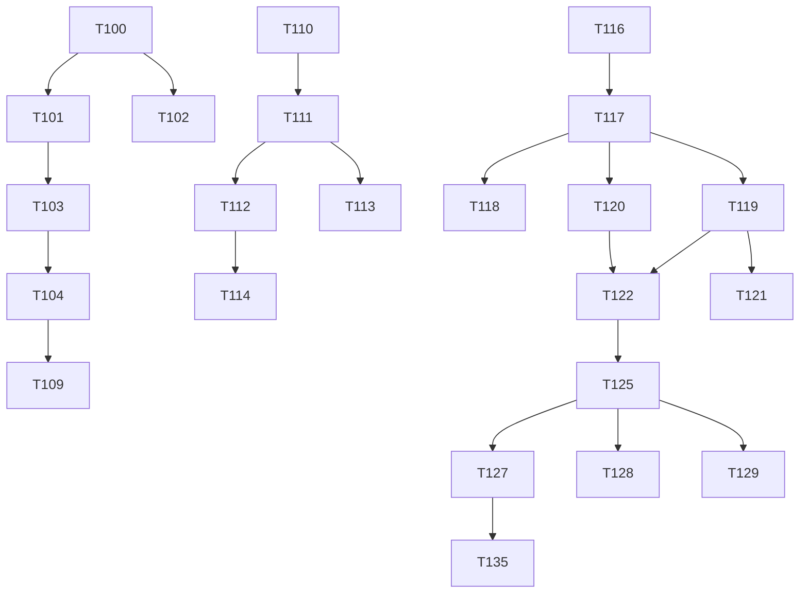

# Tasks: GitHub Repository Momentum Dashboard

**Input**: Design documents from `/specs/001-develop-a-personalized/`
**Prerequisites**: plan.md (required), research.md, data-model.md, contracts/api-spec.yaml

## Execution Flow (main)

```
1. Load plan.md from feature directory
   → If not found: ERROR "No implementation plan found"
   → Extract: tech stack, libraries, structure
2. Load optional design documents:
   → data-model.md: Extract entities → model tasks
   → contracts/: Each file → contract test task
   → research.md: Extract decisions → setup tasks
3. Generate tasks by category:
   → Setup: project init, dependencies, linting
   → Tests: contract tests, integration tests
   → Core: models, services, CLI commands
   → Integration: DB, middleware, logging
   → Polish: unit tests, performance, docs
4. Apply task rules:
   → Different files = mark [P] for parallel
   → Same file = sequential (no [P])
   → Tests before implementation (TDD)
5. Number tasks sequentially (T001, T002...)
6. Generate dependency graph
7. Create parallel execution examples
8. Validate task completeness:
   → All contracts have tests?
   → All entities have models?
   → All endpoints implemented?
9. Return: SUCCESS (tasks ready for execution)
```

## Format: `[ID] [P?] Description`

- **[P]**: Can run in parallel (different files, no dependencies)
- Include exact file paths in descriptions

## Path Conventions

- Frontend: `src/` for React components and services
- Backend: `app/api/` for Next.js API routes
- Tests: `e2e/` for Playwright, `src/__integration__/` for integration tests
- Types: `src/types/` for shared TypeScript interfaces

## Tech Stack (Updated)

- **Framework**: Next.js 15 (App Router)
- **GraphQL**: Apollo Client with GitHub GraphQL API
- **Auth**: Supabase Auth (GitHub OAuth)
- **Database**: Supabase (PostgreSQL)
- **Testing**: Vitest + React Testing Library + Playwright E2E

---

# MVP SLICE 1: Static Dashboard (T001-T020) ✅ COMPLETE

_Goal: Basic dashboard showing starred repositories_

## Phase 3.1: Setup (T001-T005)

- [x] T001 Initialize React project with Vite: `npm create vite@latest . -- --template react-ts`
- [x] T002 Install core dependencies: `npm install @tanstack/react-query tailwindcss @headlessui/react`
- [x] T003 [P] Configure TailwindCSS in `tailwind.config.js` and `src/index.css`
- [x] T004 [P] Set up ESLint and Prettier with configs in `.eslintrc.json` and `.prettierrc`
- [x] T005 [P] Create environment variables file `.env.local` with VITE_GITHUB_CLIENT_ID placeholder

## Phase 3.2: Type Definitions (T006-T007)

- [x] T006 [P] Create TypeScript interfaces in `src/types/index.ts` for User and Repository
- [x] T007 [P] Create API response types in `src/types/api.ts` for GitHub API responses

## Phase 3.3: Authentication Setup (T008-T011)

- [x] T008 Create Supabase project and configure GitHub OAuth provider in dashboard
- [x] T009 Install Supabase client: `npm install @supabase/supabase-js`
- [x] T010 Create Supabase client configuration in `src/services/supabase.ts`
- [x] T011 Create auth context provider in `src/contexts/AuthContext.tsx`

## Phase 3.4: Core Components (T012-T016)

- [x] T012 Create Login page component in `src/pages/Login.tsx` with GitHub OAuth button
- [x] T013 Create Header component in `src/components/Header.tsx` with user info and logout
- [x] T014 Create RepoCard component in `src/components/RepoCard.tsx` to display repository info
- [x] T015 Create Dashboard page in `src/pages/Dashboard.tsx` with repository list
- [x] T016 [P] ~~Create Loading component~~ _Skipped: existing approach with inline loading states works fine_

## Phase 3.5: API Integration (T017-T019)

- [x] T017 Create GitHub service in `src/services/github.ts` to fetch starred repositories
- [x] T018 ~~Create serverless function in `api/starred.ts`~~ _Skipped: client-side GitHub API calls work well_
- [x] T019 Set up React Query hooks in `src/hooks/useRepositories.ts` for data fetching

## Phase 3.6: Routing & Polish (T020)

- [x] T020 Configure React Router in `src/App.tsx` with Login and Dashboard routes
  - _Note: Will be replaced by Next.js file-based routing in migration_

---

# MVP SLICE 2: Live Metrics (T021-T032) ✅ COMPLETE

_Goal: Add current metrics and growth indicators_

## Phase 3.7: Enhanced Types (T021-T022)

- [x] T021 [P] Extend Repository type in `src/types/index.ts` with metrics fields
- [x] T022 [P] Create MetricsData type for growth calculations _(implemented as `RepositoryMetrics` interface)_

## Phase 3.8: Metrics Utilities (T023-T025)

- [x] T023 [P] Create metrics calculation utilities in `src/utils/metrics.ts`
- [x] T024 [P] Create date formatting utilities in `src/utils/formatters.ts` _(implemented in `src/utils/relativeTime.ts`)_
- [x] T025 [P] Create sorting utilities in `src/utils/sort.ts`

## Phase 3.9: Enhanced API & Caching (T026-T028b)

- [x] T026 Add `fetchRepositoryReleases()` to `src/services/github.ts` for lazy-loading releases
- [x] T027 ~~Create `api/metrics.ts` endpoint~~ _Deferred: Real growth rates require historical data_
- [x] T028 ~~Update `src/services/github.ts` to use enhanced endpoints~~ _Skipped: No serverless endpoints_
- [x] T028a Configure TanStack Query with caching settings _(configured in `src/App.tsx`)_
- [x] T028b Create `src/utils/formatters.ts` with relative time formatting

## Phase 3.10: UI Updates (T029-T032)

- [x] T029 Update RepoCard to display metrics with growth indicators
- [x] T032 [P] Create HotBadge component in `src/components/HotBadge.tsx` for trending repos

---

# MVP SLICE 3: Navigation & Radar Feature (T033-T055) ⚠️ MOSTLY COMPLETE

_Goal: Sidebar navigation, radar collections, and repository detail pages_
_See [ux-spec.md](./ux-spec.md) for detailed UX requirements_

## Phase 3.11: Layout & Navigation (T033-T038)

- [x] T033 Create Sidebar component in `src/components/Sidebar.tsx` with My Stars, Explore nav items
- [x] T034 Create SidebarRadarList component for displaying user's radars with counts
- [x] T035 Create MobileDrawer component with hamburger menu trigger
- [x] T036 Create AppLayout wrapper component that combines Header, Sidebar, and main content
- [x] T037 Update routing in `src/App.tsx`: add /stars, /explore, /radar/:id, /repo/:id routes
  - _Note: Will be replaced by Next.js file-based routing in migration_
- [x] T037a Wire up StarsPage and ExplorePage to use RepositoryList component with data hooks
- [x] T038 Redirect /dashboard to /stars, update post-login redirect to /stars

## Phase 3.12: Supabase Schema (T039-T042a)

- [x] T039 Create Supabase migration `supabase/migrations/001_create_radars.sql` with both `radars` and `radar_repos` tables
- [x] T039a Apply migrations to Supabase instance via CLI (`supabase db push`)
- [x] T040 Update database types in `src/types/database.ts` with Radar and RadarRepo interfaces
- [x] T041 Create radar service functions in `src/services/radar.ts` (CRUD operations, enforce limits)
- [x] T042 Create Supabase migration for repo_cache table
- [x] T042a Create cache service in `src/services/cache.ts` for persistent Supabase caching

## Phase 3.13: Radar UI Components (T043-T049)

- [x] T043 Create useRadars hook in `src/hooks/useRadars.ts` for fetching user's radars
- [x] T044 Create ManageRadarsModal component for "Add to Radar" interaction
- [ ] T045 Create BottomSheet component for mobile "Add to Radar" interaction (client component)
- [x] T046 Add radar icon to RepoCard with filled/outline states
- [x] T047 Create radar sweep animation CSS/component for add-to-radar feedback
- [x] T048 Create CreateRadarModal component for creating new radars from sidebar
- [x] T049 Create RadarContextMenu component with Rename/Delete actions

## Phase 3.14: Radar Page & Detail Page (T050-T053, T030-T031)

- [x] T050 Create RadarPage component in `src/pages/RadarPage.tsx` with header and repo list
- [x] T051 Create RepoDetailPage component in `src/pages/RepoDetailPage.tsx`
- [x] T052 Update RepoCard click behavior to navigate to internal detail page
- [x] T030 Add refresh button to detail page
- [x] T031 Add last updated timestamp to detail page
- [x] T053 Create EmptyState components for empty radar, no stars, no search results

## Phase 3.15: Search & Polish (T054-T055)

- [ ] T054 Create CollapsibleSearch component with ⌘K shortcut support (integrate with Next.js navigation)
- [ ] T055 Add limit handling UI (disabled states, tooltips for 5 radars/25 repos/50 total limits)

---

# NEXT.JS MIGRATION PHASE 0: Testing Infrastructure (T100-T109)

_Goal: Establish E2E and integration testing before major refactoring_
_Priority: Do first to ensure quality during migration_

## Phase 4.1: Playwright Setup (T100-T105)

- [ ] T100 Install Playwright: `npm install -D @playwright/test && npx playwright install`
- [ ] T101 [P] Create Playwright config in `playwright.config.ts` with projects for chromium, firefox, webkit
- [ ] T102 [P] Create E2E test directory structure: `e2e/` with page objects in `e2e/pages/`
- [ ] T103 Create E2E auth fixtures for GitHub OAuth mock/bypass in `e2e/fixtures/auth.ts`
- [ ] T104 Create first E2E tests: login flow, view starred repos, create/delete radar
- [ ] T105 Add Playwright scripts to package.json: `test:e2e`, `test:e2e:ui`, `test:e2e:headed`

## Phase 4.2: Integration Tests (T106-T109)

- [ ] T106 Create integration test directory: `src/__integration__/`
- [ ] T107 [P] Create integration test for radar CRUD flow (real component tree, mocked API)
- [ ] T108 [P] Create integration test for repository search and filtering
- [ ] T109 Configure CI workflow for E2E tests in `.github/workflows/e2e.yml`

---

# NEXT.JS MIGRATION PHASE 1: Foundation (T110-T115)

_Goal: Convert project structure to Next.js while maintaining current functionality_

## Phase 4.3: Next.js Setup (T110-T115)

- [ ] T110 Replace Vite with Next.js 15:
  - Run `npx create-next-app@latest temp-next --typescript --tailwind --eslint --app --src-dir`
  - Migrate configuration files
  - Remove: `vite`, `@vitejs/plugin-react`, `react-router-dom`
  - Add: `next`

- [ ] T111 Create `app/` directory structure:
  ```
  app/
  ├── layout.tsx          # Root layout (providers, global styles)
  ├── page.tsx            # Home/landing page
  ├── (auth)/
  │   └── login/page.tsx  # Login page
  ├── (dashboard)/
  │   ├── layout.tsx      # Dashboard layout (sidebar, header)
  │   ├── stars/page.tsx  # My Stars page
  │   ├── explore/page.tsx # Explore page
  │   ├── radar/[id]/page.tsx # Radar detail
  │   └── repo/[id]/page.tsx  # Repo detail
  └── api/                # API routes (if needed)
  ```

- [ ] T112 Create root layout with providers in `app/layout.tsx`: ApolloProvider, AuthProvider
- [ ] T113 Migrate auth context to work with Next.js (server/client boundary in `src/contexts/`)
- [ ] T114 Create `middleware.ts` for auth protection on dashboard routes
- [ ] T115 Update environment variables: `VITE_*` → `NEXT_PUBLIC_*`

---

# NEXT.JS MIGRATION PHASE 2: Apollo Client + GraphQL (T116-T125)

_Goal: Replace REST + TanStack Query with Apollo Client + GitHub GraphQL API_

## Phase 4.4: Apollo Setup (T116-T118)

- [ ] T116 Install Apollo dependencies:
  ```bash
  npm install @apollo/client @apollo/experimental-nextjs-app-support graphql
  npm uninstall @tanstack/react-query
  ```

- [ ] T117 Create Apollo Client configuration in `src/lib/apollo-client.ts`:
  - Configure for Next.js App Router (SSR + client hydration)
  - Set up GitHub GraphQL endpoint with auth headers
  - Configure cache policies (cache-and-network for lists, cache-first for details)

- [ ] T118 Create ApolloWrapper provider component for `app/providers.tsx`

## Phase 4.5: GraphQL Queries (T119-T121)

- [ ] T119 [P] Define GraphQL queries in `src/graphql/queries/`:
  - `starred.ts` - Starred repositories with pagination
  - `repository.ts` - Single repo details
  - `releases.ts` - Repository releases
  - `search.ts` - Repository search

- [ ] T120 [P] Define GraphQL fragments in `src/graphql/fragments/`:
  - `RepositoryFields.ts` - Common repository fields
  - `ReleaseFields.ts` - Release information

- [ ] T121 Generate TypeScript types from GraphQL schema:
  - Install `@graphql-codegen/cli` and plugins
  - Create `codegen.ts` configuration
  - Add `npm run codegen` script

## Phase 4.6: Apollo Hooks (T122-T125)

- [ ] T122 Create Apollo hooks to replace TanStack Query hooks:
  - `useStarredRepositories()` - replaces `useAllStarredRepositories`
  - `useRepository()` - replaces existing hook
  - `useReleases()` - replaces existing hook
  - `useSearchRepositories()` - replaces `useInfiniteSearch`

- [ ] T123 Implement Apollo cache updates for radar operations:
  - Optimistic updates when adding/removing repos from radars
  - Cache invalidation patterns

- [ ] T124 Add Apollo error handling:
  - GraphQL error link for consistent error handling
  - Rate limit tracking from response extensions (5000/hour for GraphQL)

- [ ] T125 Remove TanStack Query:
  - Delete old `src/hooks/use*.ts` files that used TanStack Query
  - Remove QueryClientProvider from providers
  - Update all components to use Apollo hooks

---

# NEXT.JS MIGRATION PHASE 3: Server Components (T126-T137)

_Goal: Move data fetching to server where beneficial_

## Phase 4.7: Server Component Conversion (T126-T134)

- [ ] T126 Identify and document server component candidates:
  - Static content (landing page, empty states)
  - Initial data fetch pages (stars list, radar list)
  - Repository detail page (initial load)

- [ ] T127 Convert StarsPage to Server Component with client interactivity islands
- [ ] T128 Convert RadarPage to Server Component with streamed loading
- [ ] T129 Convert RepoDetailPage to Server Component

- [ ] T130 Create `"use client"` boundary components for interactive features:
  - `src/components/client/SearchBar.tsx` - Search/filter UI
  - `src/components/client/AddToRadarButton.tsx` - Add to radar actions
  - `src/components/client/SortControls.tsx` - Sort controls

- [ ] T131 [P] Implement React Server Components data fetching patterns
- [ ] T132 [P] Add `loading.tsx` files for Suspense boundaries
- [ ] T133 [P] Add `error.tsx` files for error boundaries
- [ ] T134 Optimize with `generateStaticParams` where applicable

## Phase 4.8: Apollo + RSC Integration (T135-T137)

- [ ] T135 Configure Apollo for RSC data fetching in server components
- [ ] T136 Use `getClient()` in server components for direct queries
- [ ] T137 Implement Apollo hydration for client component cache seeding

---

# SLICE 4: Trend Detection (T138-T155)

_Goal: Historical tracking and trend visualization with Next.js patterns_

## Phase 5.1: Historical Data Schema (T138-T141)

- [ ] T138 Create Supabase migration for `star_metrics` table in `supabase/migrations/`
- [ ] T139 [P] Create Supabase migration for `issue_metrics` table
- [ ] T140 [P] Update database types in `src/types/database.ts` for metrics entities
- [ ] T141 Create metrics service in `src/services/metrics.ts`

## Phase 5.2: Data Collection (T142-T147)

- [ ] T142 Create Next.js API route for data sync: `app/api/sync/route.ts`
- [ ] T143 Configure Vercel cron job in `vercel.json` for daily sync
- [ ] T144 Create sync status API route: `app/api/sync-status/route.ts`
- [ ] T145 Add sync status indicator component (client component)
- [ ] T146 Add GitHub API rate limit tracking to API calls (log X-RateLimit headers)
- [ ] T147 Create rate limit alert system using Resend Free Tier (email at 75% and 90% thresholds)

## Phase 5.3: Trend Calculations (T148-T150)

- [ ] T148 [P] Create trend calculation utilities in `src/utils/trends.ts`
- [ ] T149 Update metrics service to fetch historical data via GraphQL
- [ ] T150 Create useTrends Apollo hook in `src/hooks/useTrends.ts`

## Phase 5.4: Sparkline Charts (T151-T155)

- [ ] T151 Install chart library: `npm install react-sparklines` (or lightweight alternative)
- [ ] T152 [P] Create SparklineChart client component in `src/components/charts/SparklineChart.tsx`
- [ ] T153 Add sparklines to RepoCard component (client island)
- [ ] T154 Create TrendingSection server component in `src/components/TrendingSection.tsx`
- [ ] T155 Add sort by growth rate option to RepositoryList

---

# SLICE 5: Full Analytics (T156-T177)

_Goal: Detailed analytics and complete features with Next.js patterns_

## Phase 5.5: Full Charts (T156-T160)

- [ ] T156 Install Chart.js: `npm install chart.js react-chartjs-2`
- [ ] T157 [P] Create LineChart client component in `src/components/charts/LineChart.tsx`
- [ ] T158 [P] Create BarChart client component in `src/components/charts/BarChart.tsx`
- [ ] T159 Create MetricsModal client component in `src/components/MetricsModal.tsx`
- [ ] T160 Add "View Details" action to RepoCard

## Phase 5.6: Advanced Metrics (T161-T164)

- [ ] T161 Create Next.js API route: `app/api/repos/[id]/metrics/route.ts`
- [ ] T162 Add release timeline to MetricsModal
- [ ] T163 Calculate and display issue velocity
- [ ] T164 Create useDetailedMetrics Apollo hook

## Phase 5.7: Data Export (T165-T167)

- [ ] T165 [P] Create CSV export utility in `src/utils/export.ts`
- [ ] T166 Add export button to radar views (client component)
- [ ] T167 Create export API route: `app/api/export/route.ts`

## Phase 5.8: Account Management (T168-T170)

- [ ] T168 Create AccountSettings page as server component with client forms: `app/(dashboard)/settings/page.tsx`
- [ ] T169 Create account deletion API route: `app/api/user/delete/route.ts`
- [ ] T170 Implement soft delete with 30-day recovery window

## Phase 5.9: PWA & Polish (T171-T173)

- [ ] T171 [P] Configure Next.js PWA plugin in `next.config.js`
- [ ] T172 [P] Create PWA manifest and icons in `public/`
- [ ] T173 Performance optimization: implement virtual scrolling for large lists (client component)

## Phase 5.10: Test Architecture (T174-T177)

- [ ] T174 Update integration test structure for Next.js app router
- [ ] T175 [P] Refactor tests for server/client component boundaries
- [ ] T176 Update CLAUDE.md with Next.js testing guidelines
- [ ] T177 Add keyboard shortcuts for sidebar navigation (client component):
  - `s` or `1` → Jump to My Stars
  - `e` or `2` → Jump to Explore
  - `3`-`9` → Jump to Radar 1-7

---

## Technical Debt

- [ ] T097 Remove unused `totalFetched` field from `AllStarredData` interface and related code
  - Files to update: `src/services/github.ts`, `src/hooks/useRepository.ts`, etc.
- ~~[ ] T098 Update legacy Tailwind classes to v4 canonical names~~ → Handled during migration
- [ ] T099 Fix starred search never enabling for users with 0 starred repos

---

## Parallel Execution Examples

### Batch 1: Testing Setup (can run together)

```bash
# Terminal 1
Task T101: Create Playwright config

# Terminal 2
Task T102: Create E2E directory structure
```

### Batch 2: GraphQL Queries (can run together)

```bash
# Terminal 1
Task T119: Define GraphQL queries

# Terminal 2
Task T120: Define GraphQL fragments
```

### Batch 3: Server Component Helpers (can run together)

```bash
# Terminal 1
Task T131: Implement RSC data fetching patterns

# Terminal 2
Task T132: Add loading.tsx files

# Terminal 3
Task T133: Add error.tsx files
```

## Task Dependencies



## Validation Checklist

- ✅ All API endpoints from contracts have implementation tasks
- ✅ All entities from data-model have type definitions
- ✅ Authentication flow is complete (T008-T011)
- ✅ Each slice builds on the previous one
- ✅ Parallel tasks marked with [P] don't share files
- ✅ Testing tasks included (E2E + integration)
- ✅ Performance optimizations in final slice
- ✅ Next.js migration phases structured for incremental delivery

## Notes

1. **Migration Strategy**: Complete Phase 0 (testing) first to ensure quality during migration
2. **Apollo over TanStack Query**: Industry-standard GraphQL client, replaces React Query entirely
3. **Server Components**: Use where beneficial for initial page loads, keep interactivity in client components
4. **Parallel Execution**: Tasks marked [P] can run simultaneously if they modify different files
5. **Environment Setup**: Requires Supabase account, GitHub OAuth app, and Vercel for deployment
6. **Deployment**: Each phase is independently deployable to Vercel

---

**Total Tasks**: 98
**Completed**: 47 tasks (Slices 1-3 mostly complete)
**Migration Tasks**: 38 tasks (T100-T137)
**Feature Tasks**: 40 tasks (T138-T177)
**Technical Debt**: 2 tasks

---

## Migration Summary

| Phase | Tasks | Description |
|-------|-------|-------------|
| Phase 0 | T100-T109 | Testing Infrastructure (Playwright + Integration) |
| Phase 1 | T110-T115 | Next.js Foundation (App Router setup) |
| Phase 2 | T116-T125 | Apollo Client + GraphQL |
| Phase 3 | T126-T137 | Server Components Conversion |
| Slice 4 | T138-T155 | Trend Detection (with Next.js patterns) |
| Slice 5 | T156-T177 | Full Analytics (with Next.js patterns) |
